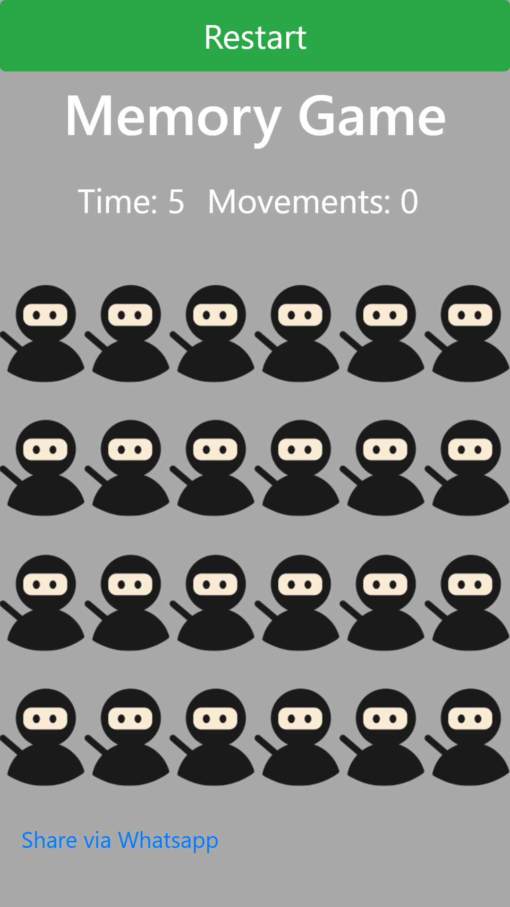
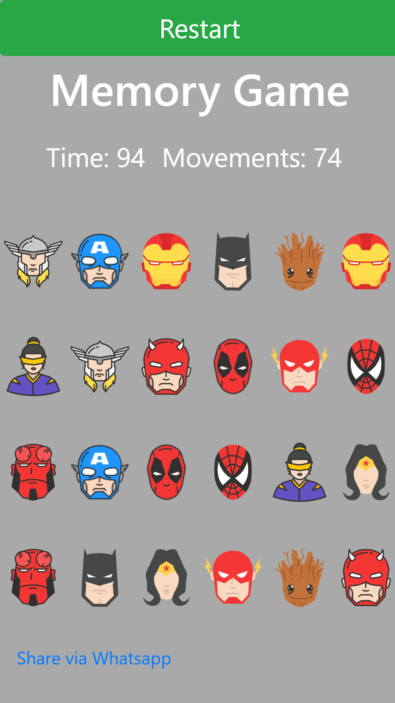

## A basic memory game built with html, js, css and bootstrap.

Access the game on [https://alexandreweber.github.io/memory-game/](https://alexandreweber.github.io/memory-game/)

At the moment you access the game will start automatically. On the top of the screen it will be displayed the time and the count of the movements you are doing during the game.

By the end of the game after you match all the heroes see your result in time (seconds) and the number of movements. 

The next time you play try to be faster and smarter to overcome your own record :).

To run the game locally clone the repository and open in a simple live server or simply open index.html on your favorite browser.

**There is a link on the bottom of the page to share the game on WhatsApp :)**